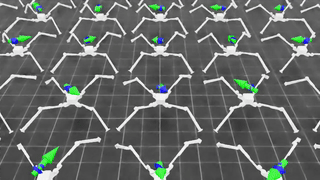
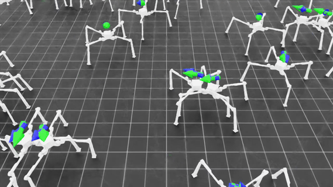

# Isaac LAB for 12-DOF Four-Legged Ant Robot

This repository presents an implementation for a 12-DOF four-legged Ant robot using Isaac Sim & LAB.

---
## 🏃‍♂️ Training Progress

  &nbsp;&nbsp;&nbsp;&nbsp;
  

---

## ✨ Features

* **Ant v0.0.0**: First version of Ant robot added.
* **Leverages RSL-RL**: Built upon the efficient RSL-RL library [2] for powerful reinforcement learning.
* **Extremely Easy Setup**: "One-file" implementation (excluding the argument file), designed to get you up and understand what's going on quickly.
* **Minimized Dependencies**: Simply clone and run – we've minimized dependencies to offer a smooth experience.
  
---
## How to Understand train.py?

1. **Line 1--33**: Isaac Sim App Initialization
2. **Line 36--54**: RSL-RL Framework Setup
3. **Line 107--226**: : Robot Model Definition (mass, inertia, actuator) 
4. **Line 224--425**:  State & Action Space Configuration, Reward Function Design
5. **Line 428--463**: Define RSL-RL agent and gymnasium register.
6. **Line 466--**: Training Loop

---

## 🚀 Getting Started

This repository has been tested on **Ubuntu 22.04**.

### Setup Instructions:

1.  **Install Isaac Sim & Isaac LAB**:
    Follow the official installation guide for Isaac Sim and Isaac LAB. 
    [https://isaac-sim.github.io/IsaacLab/main/source/setup/installation/](https://isaac-sim.github.io/IsaacLab/main/source/setup/installation/)

2.  **Unzip Assets**:
    Ensure you unzip the necessary USD assets into the designated folder within this repository.

3.  **Enjoy Training!**:
    You're now ready to dive into training Ant robot.
    ``python train.py --headless''

---
## Reference:

[1] https://github.com/jaykorea/Isaac-RL-Two-wheel-Legged-Bot

[2] https://github.com/leggedrobotics/rsl_rl
